# 📋 Guía de Flujo de la API - SGL DISASUR

Este documento explica el flujo operacional completo de la API, desde la configuración inicial hasta las operaciones del día a día.

---

## 🚀 1. Configuración Inicial

### 1.1 Base de Datos

```powershell
# 1. Crear la base de datos PostgreSQL
psql -U postgres
CREATE DATABASE sgl_disasur;
\q

```

### 1.2 Configurar Variables de Entorno

Editar `.env`:
```env
DB_HOST=localhost
DB_PORT=5432
DB_USER=postgres
DB_PASSWORD=tu_password
DB_NAME=sgl_disasur
JWT_SECRET_KEY=tu_secret_key_super_segura
```

### 1.3 Crear Usuario Administrador

```powershell
.\create_admin_simple.ps1
```

---

## 🔐 2. Autenticación

### 2.1 Login

**Endpoint**: `POST /api/v1/auth/login`

```json
{
  "username": "admin",
  "password": "password123"
}
```

**Respuesta**:
```json
{
  "token": "eyJhbGciOiJIUzI1NiIsInR5cCI6IkpXVCJ9...",
  "user": {
    "id": "uuid",
    "username": "admin",
    "role": "ADMIN_TI"
  }
}
```

> 💡 **Importante**: Guarda el token JWT. Debes incluirlo en todas las peticiones subsecuentes como:
> ```
> Authorization: Bearer {token}
> ```

---

## 📦 3. Flujo de Recepción (Módulo 1)

### 3.1 Crear Productos (HU-04)

**Endpoint**: `POST /api/v1/products`

```json
{
  "sku": "JMX-001",
  "name": "Jugo Jumex Mango 1L",
  "brand": "JUMEX",
  "category": "JUGOS",
  "barcode": "7501234567890",
  "weight_kg": 1.0,
  "length_cm": 8.0,
  "width_cm": 8.0,
  "height_cm": 25.0,
  "is_fragile": false,
  "unit_price": 18.50
}
```

### 3.2 Crear Proveedor

Primero necesitas un proveedor. Insertar en BD:
```sql
INSERT INTO suppliers (name, contact_person, phone, email)
VALUES ('Jugos del Valle S.A.', 'Juan Pérez', '3312345678', 'compras@jugos.com');
```

### 3.3 Crear Orden de Recepción (HU-01)

**Endpoint**: `POST /api/v1/reception/orders`

```json
{
  "supplier_id": "uuid-del-proveedor",
  "invoice_number": "FACT-2024-001",
  "expected_date": "2024-12-20T10:00:00Z",
  "lines": [
    {
      "product_id": "uuid-del-producto",
      "expected_quantity": 100
    }
  ]
}
```

### 3.4 Conteo Ciego (HU-02/03)

**Endpoint**: `POST /api/v1/reception/blind-count`

```json
{
  "reception_order_id": "uuid-de-orden",
  "lines": [
    {
      "product_id": "uuid-del-producto",
      "lot_number": "LOTE-2024-12",
      "counted_quantity": 98,
      "expiration_date": "2025-12-31",
      "warehouse_location": "A1-B2-C3",
      "condition": "BUENA"
    }
  ]
}
```

> ⚠️ **Validación Automática**: Si la cantidad contada difiere de la esperada, el sistema genera una discrepancia.

### 3.5 Procesar Devoluciones (HU-14)

**Endpoint**: `POST /api/v1/reception/returns`

```json
{
  "product_id": "uuid-del-producto",
  "quantity": 5,
  "condition": "APTA",  // o "DESECHO"
  "reason": "Cliente devolvió producto en buen estado"
}
```

**Flujo**:
- `APTA` → Se envía a **CUARENTENA**
- `DESECHO` → Se marca para **DESCARTE**

---

## 📊 4. Flujo de Inventario (Módulo 2)

### 4.1 Monitor de Stock (HU-05)

**Endpoint**: `GET /api/v1/inventory/stock`

Parámetros opcionales:
- `?brand=JUMEX` - Filtrar por marca
- `?category=JUGOS` - Filtrar por categoría

**Respuesta**:
```json
[
  {
    "product_id": "uuid",
    "product_name": "Jugo Jumex Mango 1L",
    "brand": "JUMEX",
    "total_quantity": 500,
    "alert_status": "OK"  // o "PUNTO_REORDEN", "CRITICO"
  }
]
```

### 4.2 Lotes FEFO (HU-06)

**Endpoint**: `GET /api/v1/inventory/fefo/{product_id}`

**Respuesta** (ordenada por fecha de caducidad):
```json
[
  {
    "inventory_id": "uuid",
    "lot_number": "LOTE-2024-12",
    "quantity": 100,
    "expiration_date": "2025-01-15",
    "days_until_expiry": 27,
    "expiration_alert": "ALERTA ROJA: Caducidad menor a 30 días",
    "warehouse_location": "A1-B2-C3"
  }
]
```

### 4.3 Registrar Merma (HU-13)

**Endpoint**: `POST /api/v1/inventory/damages`

```json
{
  "inventory_id": "uuid",
  "quantity": 10,
  "reason": "Producto dañado durante transporte",
  "evidence_photo_url": "/uploads/2024/12/damage_photo.jpg"
}
```

> 📸 **Obligatorio**: Primero subir foto con `POST /api/v1/files/upload`

### 4.4 Conteo Cíclico (HU-15)

**1. Generar conteos del día**:

**Endpoint**: `POST /api/v1/inventory/cycle-counts/generate`

Genera 5 ubicaciones aleatorias para contar.

**2. Realizar conteo**:

**Endpoint**: `POST /api/v1/inventory/cycle-counts/perform`

```json
{
  "location": "A1-B2-C3",
  "system_quantity": 100,
  "physical_quantity": 98,
  "notes": "Faltaron 2 unidades"
}
```

> 🔄 **Auto-ajuste**: Si hay varianza, el sistema ajusta automáticamente el inventario.

---

## 🛒 5. Flujo de Pedidos (Módulo 3)

### 5.1 Crear Cliente

**Endpoint**: `POST /api/v1/customers`

```json
{
  "name": "Tienda La Esquina",
  "rfc": "TLE123456ABC",
  "address": "Av. Principal 123",
  "city": "Guadalajara",
  "state": "Jalisco",
  "postal_code": "44100",
  "phone": "3312345678",
  "email": "contacto@laesquina.com",
  "credit_limit": 50000
}
```

### 5.2 Crear Pedido Multi-Marca (HU-07/08/09)

**Endpoint**: `POST /api/v1/orders`

```json
{
  "customer_id": "uuid-del-cliente",
  "lines": [
    {
      "product_id": "uuid-producto-1",
      "quantity": 50
    },
    {
      "product_id": "uuid-producto-2",
      "quantity": 30
    }
  ]
}
```

**El sistema automáticamente**:
1. ✅ Calcula peso y volumen total
2. ✅ **Sugiere vehículo** (HU-08)
3. ✅ Detecta productos frágiles/pesados
4. ✅ **Genera alertas de estiba** (HU-09)

**Respuesta**:
```json
{
  "order_id": "uuid",
  "order_number": "ORD-2024-001",
  "suggested_vehicle": "CAMION_3_5",
  "has_fragile_items": true,
  "has_heavy_items": true,
  "loading_alert": "ADVERTENCIA: Evitar colocar productos pesados sobre frágiles"
}
```

### 5.3 Pedidos Atorados (HU-24)

**Endpoint**: `GET /api/v1/orders/stuck?hours=4`

Lista pedidos que llevan más de 4 horas sin avanzar de estado.

---

## 🚚 6. Flujo de Flota (Módulo 4)

### 6.1 Crear Vehículo

```sql
INSERT INTO vehicles (unit_number, vehicle_type, plate, capacity_kg, capacity_m3, status)
VALUES ('U-001', 'CAMION_3_5', 'ABC-123-D', 3500, 20, 'DISPONIBLE');
```

### 6.2 Crear Chofer

```sql
INSERT INTO drivers (name, license_number, phone, status)
VALUES ('Carlos Rodríguez', 'A12345678', '3398765432', 'DISPONIBLE');
```

### 6.3 Asignar Ruta (HU-10)

**Endpoint**: `POST /api/v1/fleet/routes`

```json
{
  "route_type": "REPARTO",
  "vehicle_id": "uuid-vehiculo",
  "driver_id": "uuid-chofer",
  "orders": ["uuid-pedido-1", "uuid-pedido-2"]
}
```

### 6.4 Generar Remisión (HU-11)

**Endpoint**: `POST /api/v1/fleet/routes/{route_id}/invoice`

Genera PDF con:
- Detalles del cliente
- Lista de productos
- Información del vehículo y chofer
- Firma del cliente

### 6.5 Control de Mantenimiento (HU-16)

**Endpoint**: `POST /api/v1/fleet/vehicles/maintenance`

```json
{
  "vehicle_id": "uuid",
  "maintenance_type": "PREVENTIVO",
  "description": "Cambio de aceite y filtros",
  "cost": 1500.00,
  "next_maintenance_km": 25000
}
```

### 6.6 Check-list Pre-Salida (HU-17)

**Endpoint**: `POST /api/v1/fleet/routes/pre-departure-check`

```json
{
  "route_id": "uuid",
  "has_spare_tire": true,
  "has_tools": true,
  "has_fire_extinguisher": true,
  "fuel_level": 90,
  "tire_pressure_ok": true,
  "lights_ok": true,
  "vehicle_damage_photo": "/uploads/2024/12/vehicle_check.jpg",
  "notes": "Todo en orden"
}
```

---

## 📁 7. Upload de Archivos

**Endpoint**: `POST /api/v1/files/upload`

**Content-Type**: `multipart/form-data`

**Parámetros**:
- `file`: Archivo (JPG, PNG, PDF, XML)
- `type`: Tipo (opcional): `damage_photo`, `vehicle_photo`, `invoice`

**Limitaciones**:
- Tamaño máximo: **10MB**
- Extensiones permitidas: **JPG, PNG, PDF, XML**

**Respuesta**:
```json
{
  "url": "/uploads/2024/12/damage_photo/uuid.jpg",
  "filename": "foto_original.jpg",
  "size": 524288,
  "type": "image/jpeg"
}
```

**Organización**: Los archivos se guardan en:
```
uploads/
  └── YYYY/MM/
      ├── damage_photo/
      ├── vehicle_photo/
      └── invoice/
```

---

## 📈 8. Reportes (Módulo 6)

### 8.1 Dashboard (HU-12)

**Endpoint**: `GET /api/v1/reports/dashboard`

KPIs en tiempo real.

### 8.2 Rotación de Inventario (HU-23)

**Endpoint**: `GET /api/v1/reports/rotation`

Análisis de velocidad de salida por marca.

### 8.3 Pedidos Atorados (HU-24)

**Endpoint**: `GET /api/v1/reports/stuck-orders`

Reporte de pedidos con retrasos.

---

## 🔄 9. Flujo Completo de Ejemplo

### Escenario: Desde Recepción hasta Entrega

```mermaid
graph TD
    A[Crear Producto] --> B[Crear Orden de Recepción]
    B --> C[Conteo Ciego]
    C --> D[Inventario Actualizado]
    D --> E[Crear Cliente]
    E --> F[Crear Pedido]
    F --> G[Sistema sugiere vehículo]
    G --> H[Asignar Ruta]
    H --> I[Check-list Pre-Salida]
    I --> J[Generar Remisión]
    J --> K[Entrega]
```



**Paso a paso**:

1. **Recepción**:
   - POST /products → Crear producto
   - POST /reception/orders → Orden de recepción
   - POST /reception/blind-count → Contar físicamente
   
2. **Inventario**:
   - GET /inventory/stock → Verificar stock
   - GET /inventory/fefo/{product_id} → Ver lotes FEFO

3. **Ventas**:
   - POST /customers → Crear cliente
   - POST /orders → Crear pedido (sistema sugiere vehículo)

4. **Distribución**:
   - POST /fleet/routes → Asignar ruta
   - POST /fleet/routes/pre-departure-check → Check-list
   - POST /fleet/routes/{id}/invoice → Generar remisión
   - Marcar como entregado

---

## 🎯 10. Roles y Permisos

| Rol | Permisos |
|-----|----------|
| **ADMIN_TI** | Acceso total, gestión de usuarios |
| **JEFE_ALMACEN** | Recepción, inventario, mermas |
| **RECEPCIONISTA** | Conteo ciego, devoluciones |
| **AUXILIAR** | Conteo ciego, conteo cíclico |
| **JEFE_TRAFICO** | Pedidos, rutas, flota |
| **VENDEDOR** | Crear pedidos, clientes |
| **CHOFER** | Check-list pre-salida |
| **MONTACARGUISTA** | Conteo cíclico |

---

## 🛠️ 11. Swagger UI

Accede a la documentación interactiva:

```
http://localhost:8080/swagger/index.html
```

**Pasos para probar**:
1. Hacer login → Copiar el token
2. Click en **[Authorize]**
3. Escribir: `Bearer {token}`
4. Probar cualquier endpoint

---

## ⚡ 12. Tips y Mejores Prácticas

### 12.1 Orden de Creación

Siempre crear en este orden:
1. Productos
2. Proveedores (si no existen)
3. Órdenes de recepción
4. Clientes
5. Pedidos
6. Rutas

### 12.2 Validaciones Importantes

- ✅ **Fotos obligatorias**: Mermas (HU-13) y Check-list (HU-17)
- ✅ **FEFO obligatorio**: Siempre sacar primero lo que caduca primero
- ✅ **Conteo ciego**: No mostrar cantidades esperadas al operador

### 12.3 Estados de Pedido

```
BORRADOR → CONFIRMADO → EN_PREPARACION → LISTO → EN_RUTA → ENTREGADO
```

Pedido se considera "atorado" si pasa >4 horas en `EN_PREPARACION` o `CONFIRMADO`.

---

## 📞 13. Solución de Problemas

### Error 401 Unauthorized
- Verificar que el token JWT sea válido
- Token expira en 8 horas

### Error 403 Forbidden
- Usuario no tiene el rol necesario
- Verificar permisos del endpoint en router.go

### Error 500 Internal Server Error
- Revisar logs de la API
- Verificar conexión a base de datos

---

**Creado**: 2024-12-19  
**Versión API**: 1.0.0  
**Autor**: SGL DISASUR
